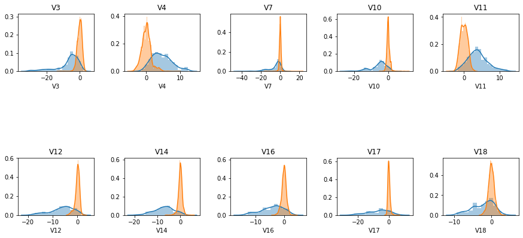
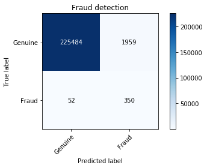

# Credit Card Fraud Detection
A `Gaussian Naive Bayes` ML classifier to classify credit card transactions as genuine or fraudulent. Credit card fraud detection dataset from kaggle (https://www.kaggle.com/mlg-ulb/creditcardfraud) was used in developing this project. Gaussian Naive Bayes is a classification machine learning algorithm which is an extension of Naive Bayes algorithm. Gaussian Naive Bayes is applied to data with real valued features.

## Getting Started

These instructions will get you a copy of the project up and running on your local machine for development and testing purposes. To get a local copy up and running follow these simple example steps.

### Prerequisites

* python 3.6

```
sudo apt-get install python3.6
```
* jupyter notebook

```
sudo apt install jupyter
```

### Installation

1. Clone the repository
```
git clone https://github.com/aashish157/Credit-Card-Fraud-Detection.git
```


### Usage

1. Open the cloned `Credit-Card-Fraud-Detection` directory and save the credit card fraud dataset csv file with name `creditcard.csv` in a data folder
2. Open the .ipynb notebook file from cloned repo on Jupyter Notebook
3. Run all the cells to test the project

### Screenshots

<p align="center">
	
</p>
	
<p align="center">
	
	
</p>


## Built With

* `[Jupyter Notebook]` (https://jupyter.org/) - Python IDE
* `[Python 3.6.8]` (https://www.python.org/) - Programming language used

## Contributing

Any contributions you make are **greatly appreciated**.

1. Fork the Project
2. Create your Feature Branch 
3. Commit your Changes
4. Push to the Branch
5. Open a Pull Request

## Authors

* **Aashish Raj Gupta** - [github](https://github.com/aashish157) - [linkedin](https://www.linkedin.com/in/aashish157)


